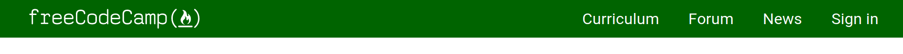

# Questions
- https://www.codecademy.com/resources/blog/css-interview-questions/

1. Tell me about an approach you took to decide the layout of a project you worked on. What pushed you to choose one type of layout (Flexbox/Box/Grid) over another?

Notes: 

Answer:
This is an interesting type of question because it requires you to think back to previous projects you have worked on. Before going into a technical or behavioral interview, be sure to study up on previous projects you completed to recall choices made.

You don’t necessarily need to defend your answers, but you need to basically speak to your reasoning. The interviewers would like to hear your thought process on why you chose the approach you did. This is valuable information to them because it hints at how you might approach a problem at their company.

2. How does CSS actually work ?

Notes: 

Answer:
This question tests your ability to be able to describe what CSS is from a technical standpoint.

Start from the very beginning and describe that CSS literally means Cascading Style Sheets. It uses three ways to style the HTML document:  inline-styling, internal stylesheet, and external stylesheet.

The stylesheet is how we essentially decorate our web page. We use CSS selectors to create rules for those elements. When the CSS renders, it will take the CSS, and apply it to the document from the top to the bottom.

If there is a selector that is repeated in the stylesheet, the newest rule(s) overwrite the previous ones. Inline styles and the !important keyword maintain the highest importance and will overwrite CSS written in the stylesheet.

3. Describe pseudo-elements and pseudo-classes, discuss the differences between the two, and what they are used for.

Notes: 
- psudeo class is hover over. used to turn somthing with an action. A psuedo element probably like html selecetors. Both tools for selecting. psuedo element is differnt type of selector. 

Answer:
Pseudo-elements and pseudo-classes are quite often conflated. They are two distinct concepts in CSS. This question is designed to see if you know the difference.

The similarity between the two is that they are keywords that are added to a selector that lets you style the selector in a specific way.

A pseudo-element is added to a selector when you want to style a specific part of the selected element.

p::selection {
 background-color: yellow;
}

The ::selection pseudo-element styles the 
 tag when a user highlights text in that element. Other popular pseudo-elements are ::first-letter and ::first-line.

In contrast, the pseudo-class is added to a selector when you want to control the styling when an element is in a particular state. This applies not only to the document tree, but also to the location’s history.

button:hover {
 background-color: blue;
 color:white;
}
 
a:visited {
 color: orange;
}

a:hover {
 color: yellow;
}

All you need to remember really is that the pseudo-element styles specific parts of an element and the pseudo-class styles a specific state of an element.

4. Explain the concept of specificity.

Notes: 
- writing css, multpile people, conflicting selectors, system of points with top level being in-line, then html tags, specificity lets browser know which color something is gonna be, most points rule is applied. 

Answer:
CSS Specificity concerns itself with how style rules are applied to an HTML document. Each type of selector has a number associated with it. The higher the number, the higher the specificity. Inline-styling has the highest specificity, along with ids. Universal selectors have the lowest specificity.

When a specificity is higher, that means those styling rules will win over any sort of cascading rules.

5. Tell me about the CSS Box model and its constituent elements.

Notes: 
- way things are layed out in css by default. Inner content, out of center padding and border and margin. padding is blank space inside element, margin is blank space around element. can see box model from chrome. see spacing using tools like element selector. Very good

Answer:
The CSS Box Model was the first of the layout models that were introduced in CSS. It consists of margin, padding, content, and border.

    The margin is indicative of how far away you want your boxes to be from each other. It’s the area outside the border.
    Padding is the area in between the content and the border. The more padding there is, the more room there is between the content of your box and the border itself.
    The border of a box lays in between the padding and the margin. It frames padding and the content of the box.The feature of the box is the content. It’s what makes the box, a box.
    The feature of the box is the content. It’s what makes the box, a box.

Note: By default, CSS’s box-sizing property is content-box. To have more control over the size of the boxes on your page, change your box-sizing property to border-box. You can use the universal selector (*) to do so at the top of your CSS.

6. How would you select every paragraph with a class name of about-me that is a child of a div?

Notes:
- perfect 

Answer:
div > .about-me {
 color: red;
}

## WhiteBoard
- Instructions: Use the starter code to recreate the Navbar from the image below. First create a new repo on GitHub called Navbar_Challenge. Clone the repo to your local machine. Grab the starter code from the directory "/fluffy-code-lessons/css/interview/starter-code". 

- 

Notes:
- Nice job staying on task. Followed first task well. Nice job being prepared with good eqipment, extra screen, working mouse. Feel free to ask claryfing questions on set-up stuff. Environment set-up is often confusing and clarfying questions are totally ok. Like the laughter, always a good thing. Good job on the git portion. that can be very challenging. Good job talking through existing code. "Figure how to get this to display." Nice job with the pace. Nice job using display. Determineing why something did not work (this kind of thinking is essential). Good job using the class selectors. Trying things out is good. Nice job moving the links to right. Nice job using flex. This was the key part of this challenge. Give you a pass based on your ability to work through and critical thinking. 

Answer: https://freshman.tech/flexbox-navbar/

## Overall Notes
- Excellent job on questions. Nailed them all. Make sure to have fresh boot without other programs running. Good job talking what your thinking during interview. Explained your thoughts well. 