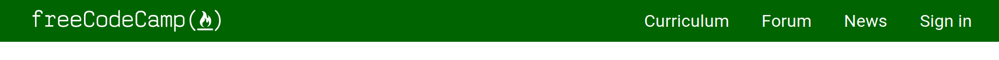

## WhiteBoard
- Instructions: Use the starter code to recreate the Navbar from the image below. First create a new repo on GitHub called Navbar_Challenge. Clone the repo to your local machine. Grab the starter code from the directory "/fluffy-code-lessons/css/interview/starter-code". Put starter code in your new repo. Recreate the navbar to match the image below. 

- 