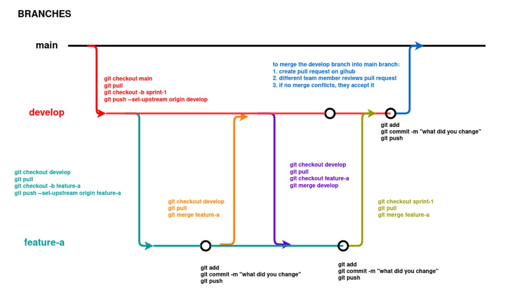

# Git Basics

## Commands
```git status```

```git add```

```git commit -m " "```

```git push```

```git pull```

### Create a new branch
```git checkout -b <BranchName>```

### Go to a branch
```git checkout <branchName>```

### Merge a branch to current branch
```git merge <branchName>```

## Branching 
